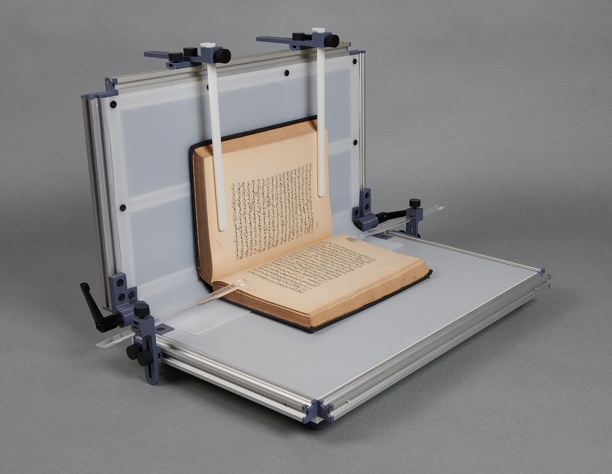

# Qirab™ Conservation Cradle - QCC50

An open-source manuscript repair support hardware design

The Qirab™ Conservation Cradle is an open-source book support design intended to securely hold books open during conservation treatment, scientific analysis, documentation, and preservation works. It facilitates a hands-free holding of the book in a stable and adjustable position without extreme pressure.

Read more on the [Qirab™ project page](https://qirab.org/en/docs/hardware/conservationcradle/).

 This work is licensed under a <a rel="license" href="http://creativecommons.org/licenses/by-sa/4.0/">Creative Commons Attribution-ShareAlike 4.0 International License</a>.
